# App Controle Financeiro

## Resume
Application developed to facilitate the user's daily financial control, with it you can check your balance for the day and be able to check your wallet's entries and exits with a date filter.

For this application, the <u><b>React Native</b></u> Framework was used.
* <u><b>Hooks</b></u>: useState, useEffect, useContext, useNavigation, useMemo.

* <u><b>Libraries</b></u>: axios, react-native-calendars, react-native-vector-icons, react-navigation/drawer, react-navigation/native-stack.

* <u><b>Styled-components.</b></u>

* <u><b>Back-end</b></u>: SQLite.

# Interface

## <u>SignIn screen:</u>
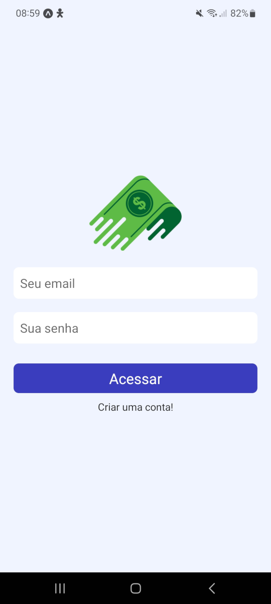
  

## <u>SignUp screen:</u>
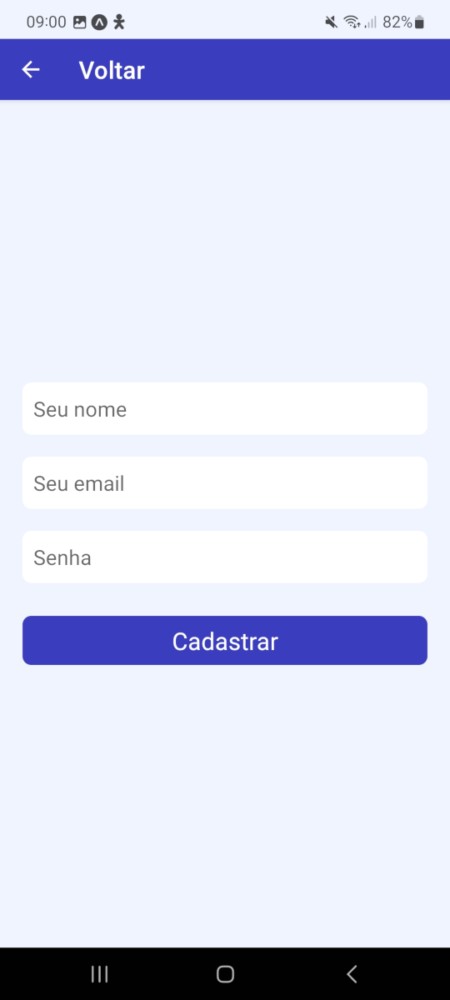
  

## <u>Home screens:</u>
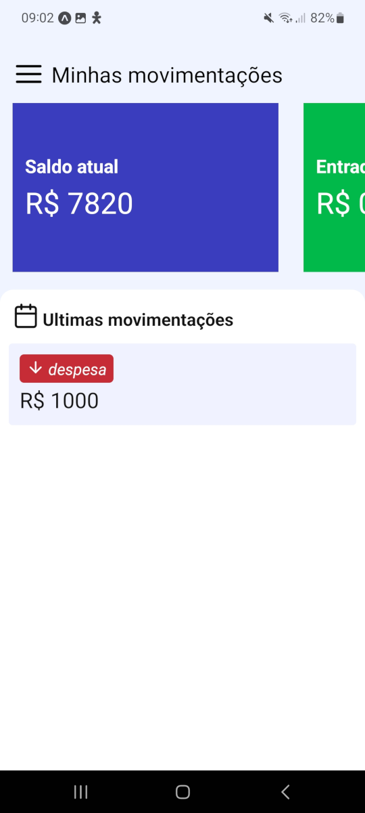
  
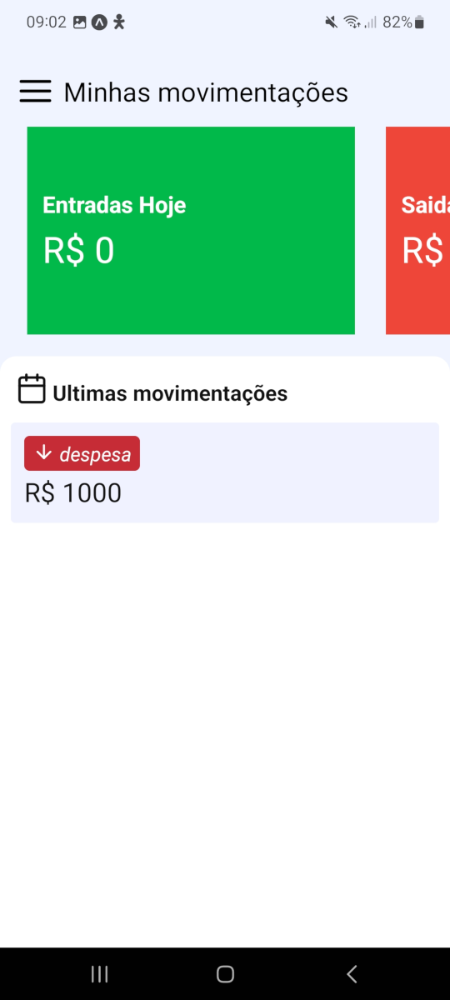
  
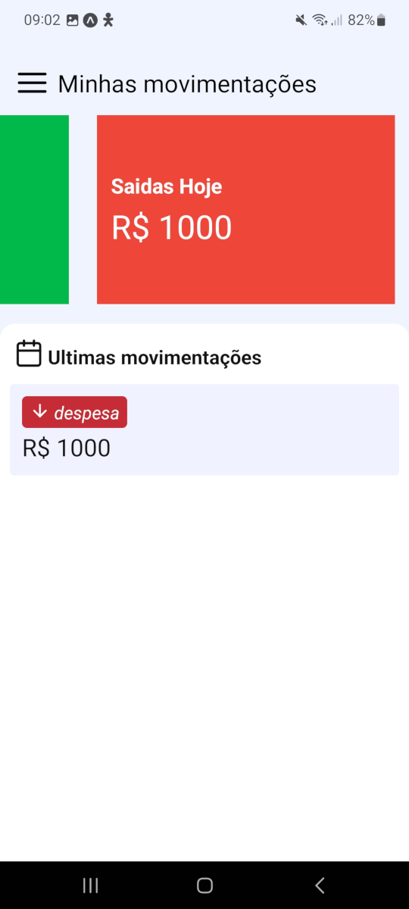

## <u>Drawer:</u>
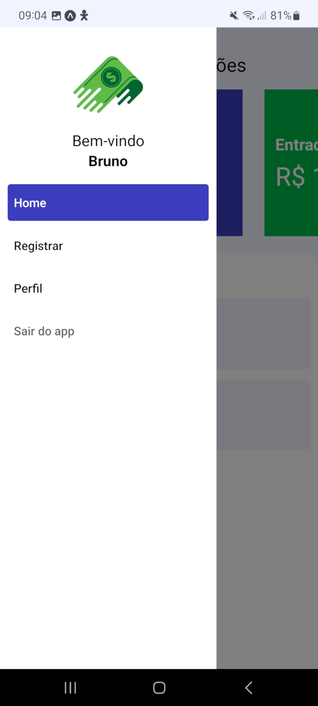

## <u>Register:</u>
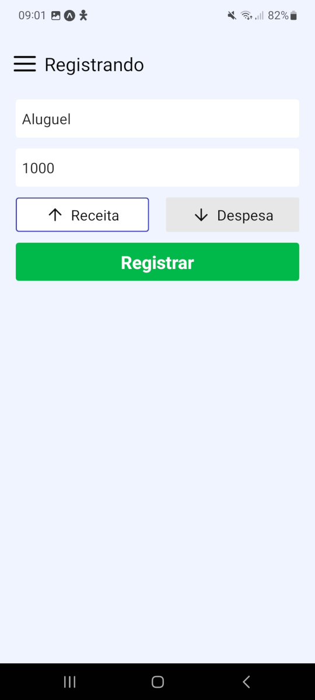
  
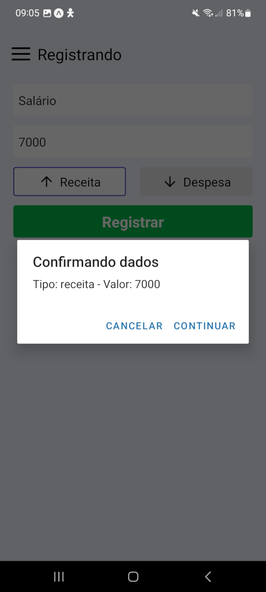
  

## <u>Calendar to filter:</u>
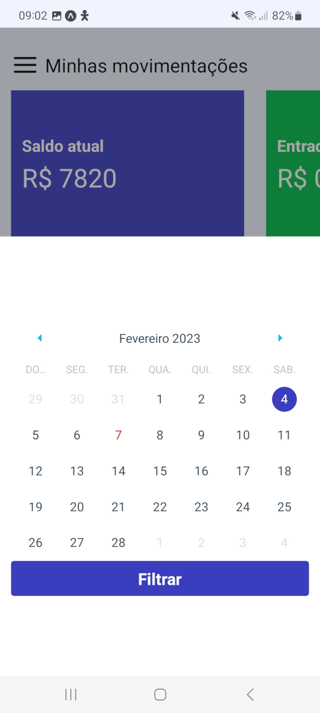
  

## <u>filtered</u>
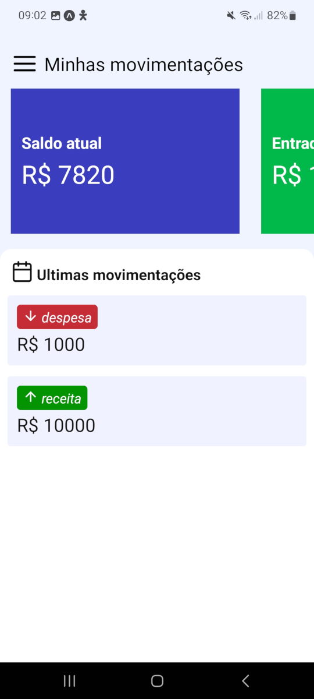
  

## <u>Delete-Alert:</u>
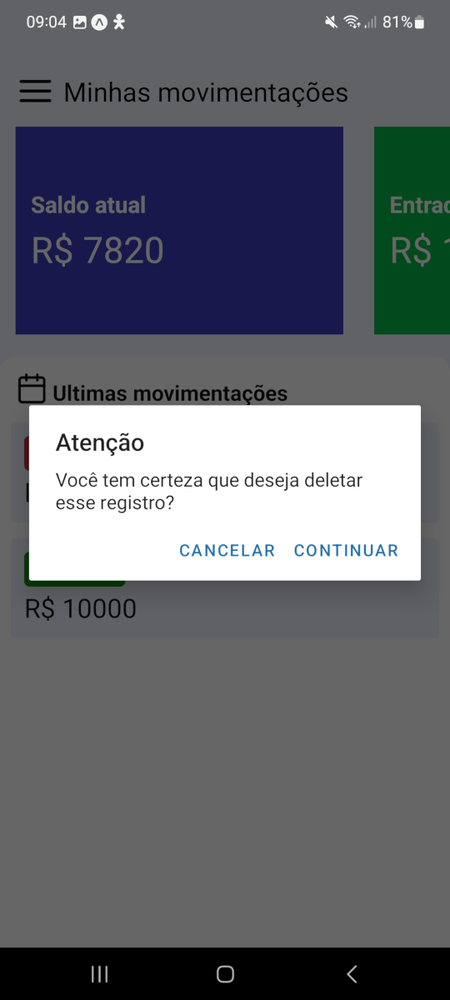
  

## <u>Perfil:</u>
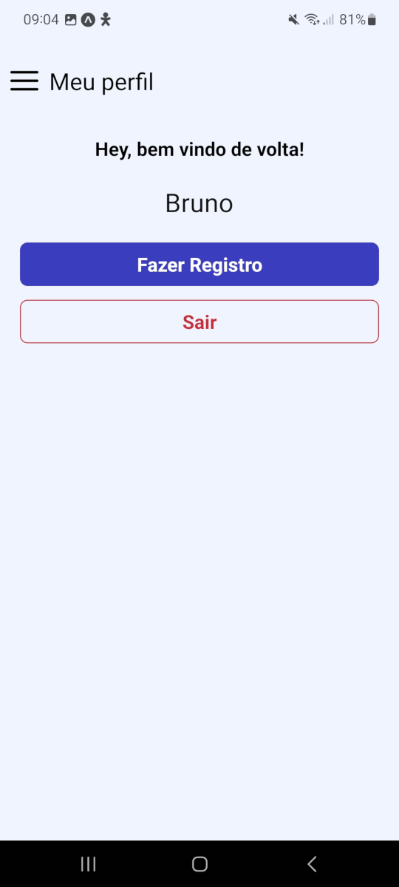
  
